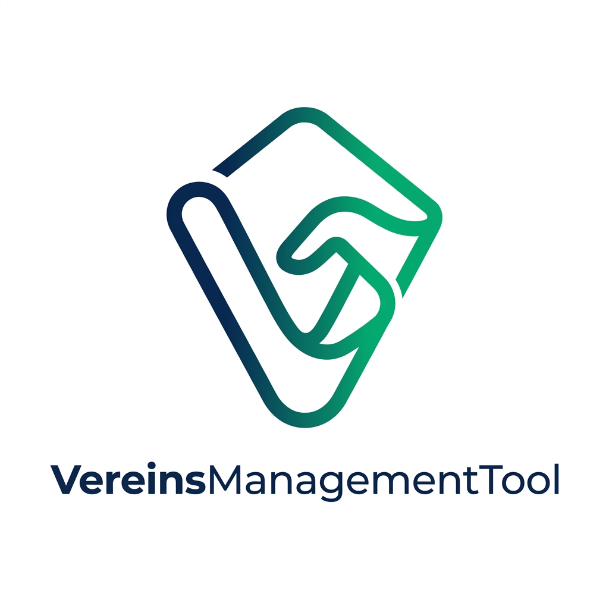

<p align="center">
  
</p>

# 🚀 VereinsManagementTool (VMT) – Version 2.2

### Endlich mehr Zeit für deinen Verein – weniger Zettelwirtschaft, mehr Gemeinschaft!

Das **VereinsManagementTool** ist dein digitaler Helfer im Vereinsalltag. Wir wissen, dass Vereinsarbeit Herzblut bedeutet – und oft viel Papierkram. Deshalb haben wir eine Lösung entwickelt, die deine Mitglieder, Finanzen und Dokumente an einem sicheren Ort verwaltet. Es ist modern, blitzschnell und so intuitiv, dass du kein Technik-Profi sein musst, um es zu lieben.

---

## ✨ Features: Alles, was dein Verein braucht

Das VMT ist modular aufgebaut und deckt alle wichtigen Bereiche der Vereinsführung ab:

### 👥 Mitgliederverwaltung
*   **Digitale Mitgliederakte:** Alle Infos (Kontakt, Geburtsdatum, Eintritt) an einem Ort.
*   **Rang-Management:** Verwalte verschiedene Mitgliedsarten (Aktiv, Passiv, Ehrenmitglieder).
*   **Intuitive Filter:** Finde blitzschnell bestimmte Gruppen oder einzelne Mitglieder.
*   **Dokumenten-Anhang:** Speichere Aufnahmeanträge oder Ausweise direkt beim Mitglied.

### 💰 Finanzmanagement & Kasse
*   **Einnahmen/Ausgaben-Journal:** Erfasse alle Kontobewegungen in Sekunden.
*   **Revisionssicherheit:** Jede Buchung ist fest mit dem Ersteller verknüpft – keine anonymen Änderungen.
*   **PDF-Export:** Generiere fertige Berichte für die Kassenprüfung oder das Finanzamt.
*   **Zahlungsarten:** Unterstützt Barzahlung, Überweisung, PayPal und mehr.

### 📦 Inventar & Lagerung
*   **Gegenstands-Tracking:** Verwalte Trikots, Bälle, Technik und Schlüssel.
*   **Feste Standorte:** Nie wieder suchen – ordne alles festen Räumen oder Schränken zu.
*   **Kategorisierung:** Gruppiere dein Eigentum für eine bessere Übersicht.

### 📄 Protokolle & Dokumente
*   **Sitzungsprotokolle:** Erstelle Meeting-Minuten direkt im Tool und exportiere sie als PDF.
*   **Zentraler Speicher:** Drag & Drop Uploader für Vereinssatzungen, Verträge und Konzepte.
*   **Vorschau-Funktion:** PDF-Dateien direkt im Browser ansehen.

### 📊 Dashboard & Master-Daten
*   **Echtzeit-Statistiken:** Visualisiere dein Vereinswachstum und deine Finanzen mit interaktiven Charts.
*   **Zentrales Setup:** Lege eigene Standorte, Ränge und Kategorien fest, um das Tool zu 100% auf deinen Verein anzupassen.
*   **Aktivitätsprotokoll:** Vollständige Transparenz darüber, welche Änderungen im System vorgenommen wurden.

---

## 💎 Die moderne Technik dahinter

Obwohl das Tool einfach zu bedienen ist, steckt unter der Haube modernste Technologie:
*   **Premium Design:** Elegantes Glassmorphism-Interface für ein erstklassiges Nutzererlebnis.
*   **Echtzeit-Interaktion:** Dank Livewire 3 musst du die Seite fast nie neu laden.
*   **Sicherheit:** Höchste Standards beim Passwort-Hashing und Datenschutz.
*   **SEO-Schutz:** Dein Vereinsheim bleibt privat und wird nicht von Google indiziert.

---

## 🌐 Erstmal reinschnuppern? (Live-Demo)

Du kannst das Tool sofort ausprobieren, ohne etwas installieren zu müssen. Schau dir unsere Demo an und erlebe, wie flüssig sich Vereinsarbeit anfühlen kann:

✨ **[JETZT DIE LIVE-DEMO STARTEN](https://verein.david-schuchert.de/)** ✨

**Deine Login-Daten für die Demo:**
*   **E-Mail:** `admin@admin`
*   **Passwort:** `admin`

---

## 📥 Für die IT-Experten (Installation)

Du möchtest das Tool für deinen eigenen Verein aufsetzen? Hier sind die technischen Details, die du für den Start benötigst.

### Voraussetzungen
*   **PHP >= 8.4**
*   **Composer** (PHP-Paketmanager)
*   **MySQL 8.0+** oder **MariaDB 10.11+**
*   **Node.js & NPM** (für das Design)

### In 4 Schritten startklar

1.  **Code holen:**
    ```
    git clone https://github.com/DavidSchuchert/VereinsManagementTool-Laravel.git
    cd VereinsManagementTool-Laravel
    ```

2.  **Werkzeuge vorbereiten:**
    ```
    composer install --no-dev --optimize-autoloader
    npm install && npm run build
    ```

3.  **Häuslich einrichten:**
    Kopiere die Datei `.env.example` zu `.env` und trage dort deine Internet-Adresse (`APP_URL`) und deine Datenbank-Daten ein.

4.  **Das digitale Vereinsheim einrichten:**
    ```
    php artisan key:generate
    php artisan migrate --seed
    php artisan storage:link
    php artisan livewire:publish --assets
    ```

---

## 🔄 Updates & Wartung (Produktion)

Wenn du das System aktualisieren möchtest, führe einfach diese Befehle nacheinander aus:

1.  `git pull`
2.  `composer install --no-dev --optimize-autoloader`
3.  `npm install && npm run build`
4.  `php artisan migrate --force`
5.  `php artisan livewire:publish --assets`
6.  `php artisan optimize`

---

### 🐳 Docker Installation (Alternative)


Du hast Docker? Noch schneller starten ohne manuelles Setup:

**Voraussetzungen:** Docker & Docker Compose

**In 3 Schritten:**

1.  **Code holen:**
    ```
    git clone https://github.com/DavidSchuchert/VereinsManagementTool-Laravel.git
    cd VereinsManagementTool-Laravel
    ```

2.  **.env Datei erstellen:**
    ```
    cp docker/.env.docker .env
    ```
    Öffne die `.env` Datei und passe folgende Werte an:
    *   `APP_URL` – deine URL (z.B. http://localhost:8181)
    *   `DB_PASSWORD` – sicheres Passwort für die Datenbank
    *   `DB_ROOT_PASSWORD` – sicheres Passwort für den MariaDB Root-User

3.  **Docker starten:**
    ```
    cd docker && docker compose up -d --build
    ```

3.  **Fertig!** Öffne [http://localhost:8181](http://localhost:8181)

**Was passiert automatisch:**
*   MariaDB 11 wird gestartet
*   Composer & NPM Dependencies werden installiert
*   Datenbank-Migrationen werden ausgeführt
*   DB wird mit Beispieldaten befüllt (`--seed`)
*   Livewire Assets werden veröffentlicht
*   Storage Link wird erstellt

**Services:**

| Service   | Port | Beschreibung |
|-----------|------|-------------|
| App       | 8181 | Apache + PHP 8.5 + Laravel |
| MariaDB   | 3307 | Datenbank (externer Zugriff) |

**Nützliche Commands:**
```
# Logs verfolgen
cd docker && docker compose logs -f

# Bash im Container
cd docker && docker compose exec app bash

# Manuell migrieren
cd docker && docker compose exec app php artisan migrate

# Frontend neu bauen
cd docker && docker compose exec app npm run build
```


---

## 🔑 Deine ersten Schritte

Nach der ersten Installation (mit `--seed`) kannst du dich so anmelden:
*   **E-Mail:** `admin@admin`
*   **Passwort:** `admin`

🔴 **WICHTIG:** Ändere bitte **sofort** nach dem ersten Login deine E-Mail und dein Passwort in deinem Profil (oben rechts auf deinen Namen klicken), um deinen Verein zu schützen!

---

## 🤝 Gemeinschaft & Support

Beiträge und Feedback sind immer willkommen! Gemeinsam machen wir das Vereinsleben ein Stück digitaler.

**Autor:** David Schuchert  
**Website:** [https://david-schuchert.de/](https://david-schuchert.de/)

*Lizenz: MIT*
